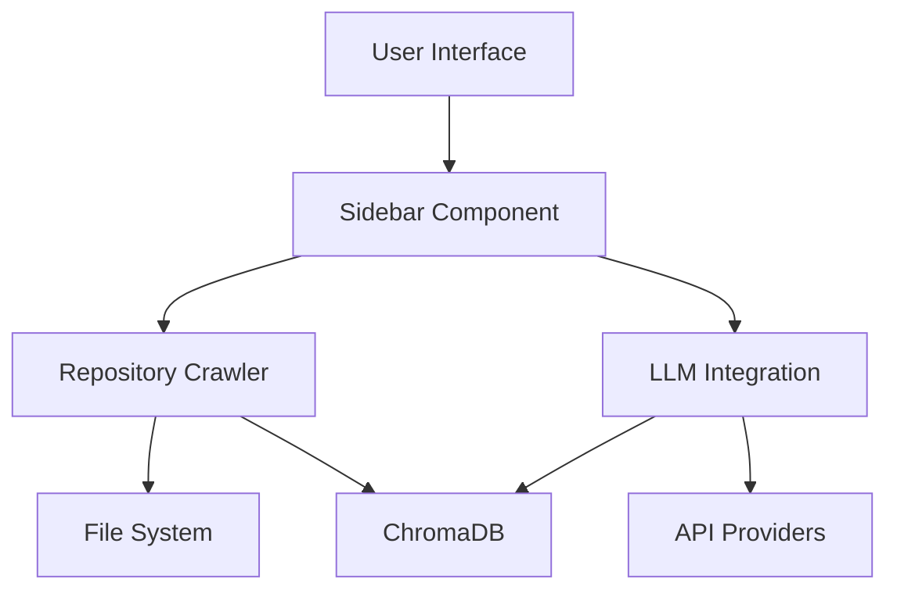

# Repository Crawler - Architecture Overview

> ⚠️ **IMPORTANT: Work in Progress - Architecture Subject to Change** ⚠️
> 
> This document describes the current architecture which is still evolving. Components and their interactions may change significantly as the project develops.

## System Components

### 1. Frontend Layer (Streamlit)
- **Dashboard UI**: Main interface with tabbed navigation
  - File Settings: Repository configuration and ignore patterns
  - LLM Settings: API key management and model selection
  - File Tree: Interactive codebase visualization
- **Components**:
  - `SidebarComponent`: Manages UI layout and state
  - `TreeView`: VS Code-style file tree visualization
  - `FileViewer`: Code display with syntax highlighting
  - Status indicators and progress tracking

### 2. Backend Core
- **Repository Management**:
  - `RepositoryCrawler`: File system traversal and analysis
  - Path validation and security checks
  - Performance optimizations for large codebases
- **Configuration Management**:
  - YAML-based configuration
  - Session state management
  - API key handling and validation

### 3. LLM Integration
- **Multi-Agent System** (In Development):
  - Up to 25 specialized roles
  - Gemini 1.5 Pro as coordinator
  - Parallel analysis capabilities
- **Providers**:
  - OpenAI (GPT-4, GPT-3.5)
  - Anthropic (Claude)
  - DeepSeek
  - Google (Gemini)

### 4. Data Storage
- **ChromaDB Integration** (Planned):
  - Persistent memory system
  - Embedding storage
  - Query optimization
- **Local Storage**:
  - Configuration files
  - Cache management
  - Session state persistence

## Current Limitations

### Performance
- Large repository handling needs optimization
- Memory usage can spike with big codebases
- UI responsiveness varies with data size

### Security
- Basic path validation implemented
- API key security needs enhancement
- Access control system pending

### Stability
- Error handling needs improvement
- Edge cases may cause crashes
- State management can be inconsistent

## Development Status

### Implemented
- Basic file system traversal
- Multi-provider LLM support
- Interactive file tree
- Configuration management
- API key handling

### In Progress
- Performance optimizations
- Security enhancements
- Error handling improvements
- Memory management
- Multi-agent coordination

### Planned
- Advanced caching system
- Distributed analysis
- Plugin architecture
- Custom role definitions
- Advanced security features

## Data Flow

## Security Considerations

- **Current Implementation**:
  - Basic path validation
  - API key encryption
  - Error logging
  - Access restrictions

- **Needed Improvements**:
  - Advanced path sanitization
  - Better key management
  - Access control system
  - Audit logging

## Performance Considerations

- **Current Optimizations**:
  - Lazy loading
  - Size-based warnings
  - Basic caching
  - State management

- **Known Issues**:
  - Large repository slowdowns
  - Memory spikes
  - UI freezes
  - Cache invalidation

## Disclaimer

This architecture is actively evolving. Components may be added, removed, or significantly modified. Use in production environments is not recommended without thorough testing and customization. 