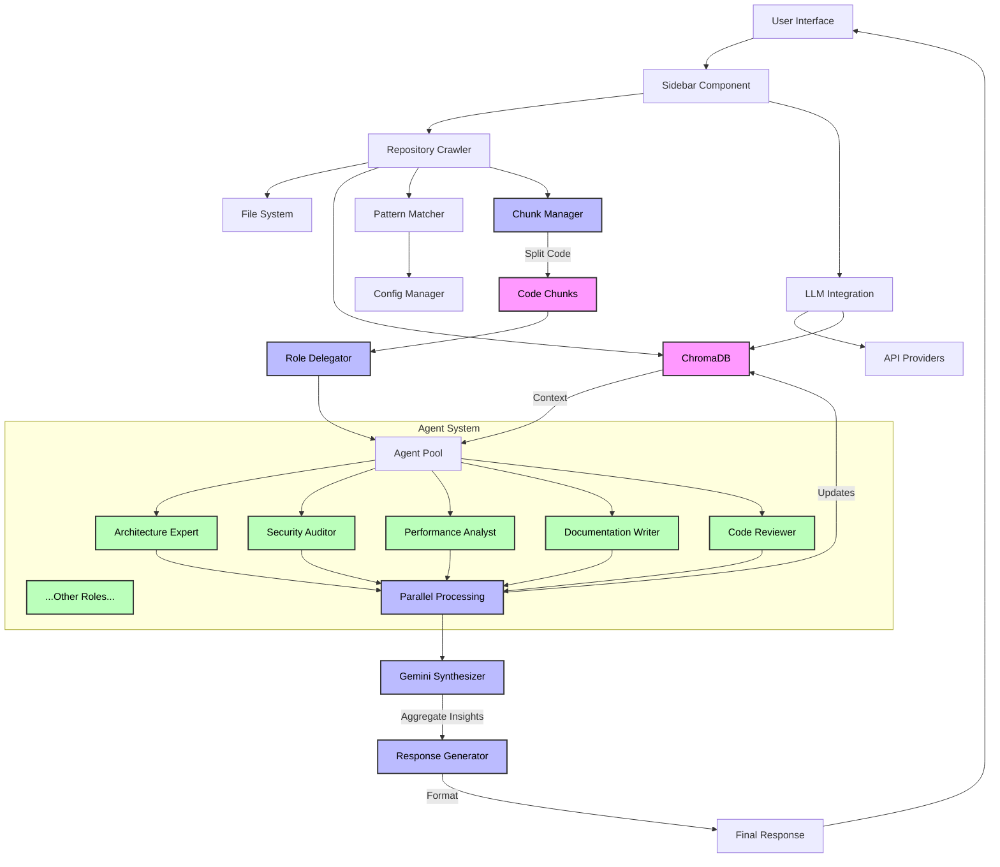

# Repository Crawler - Architecture Overview

> ⚠️ **IMPORTANT: Work in Progress - Architecture Subject to Change** ⚠️
> 
> This document describes the current architecture which is still evolving. Components and their interactions may change significantly as the project develops.

## System Components

### 1. Frontend Layer (Streamlit)
- **Dashboard UI**: Main interface with tabbed navigation
  - File Settings: Repository configuration and ignore patterns
  - LLM Settings: API key management and model selection
  - File Tree: Interactive codebase visualization
- **Components**:
  - `SidebarComponent`: Configuration and state management (sidebar.py)
  - `TreeView`: VS Code-style file tree visualization (tree_view.py)
  - `FileViewer`: Code display with syntax highlighting (file_viewer.py)
  - `IgnoreTree`: Pattern management interface (ignore_tree.py)
  - Status indicators and progress tracking

### 2. Backend Core
- **Repository Management**:
  - `RepositoryCrawler`: File system traversal and analysis
    - Robust ignore pattern matching system
    - Full path and wildcard support
    - Parent/child directory pattern matching
  - Path validation and security checks
  - Performance optimizations for large codebases
- **Configuration Management**:
  - YAML-based configuration with persistence
  - Session state management
  - API key handling and validation
  - Pattern inheritance and merging

### 3. LLM Integration
- **Multi-Agent System**:
  - Support for up to 25 specialized roles
  - Gemini 1.5 Pro as coordinator
  - Parallel analysis capabilities
- **Providers**:
  - OpenAI (GPT-4, GPT-3.5)
  - Anthropic (Claude)
  - DeepSeek
  - Google (Gemini)
  - Configurable API keys and rate limiting

### 4. Data Storage
- **ChromaDB Integration**:
  - Persistent memory system (cognitive_memory/)
  - Embedding storage and retrieval
  - Query optimization
  - SQLite backend
- **Local Storage**:
  - Configuration files (config/)
  - Cache management
  - Session state persistence
  - Log management (logs/)

## Core Features

### Pattern Matching System
- **Directory Patterns**:
  - Full path matching
  - Wildcard support (`**/`, `/**`)
  - Case-insensitive matching
  - Parent/child directory patterns
- **File Patterns**:
  - Extension-based matching
  - Full path patterns
  - Parent directory inheritance
  - Configurable exclusions

### Configuration Management
- **Hierarchical Config**:
  - Default patterns
  - User customizations
  - Project-specific overrides
- **Pattern Persistence**:
  - YAML-based storage
  - Pattern merging
  - Custom pattern preservation
  - Automatic backup

## Current Limitations

### Performance
- Large repository handling needs optimization
- Memory usage can spike with big codebases
- UI responsiveness varies with data size
- Pattern matching overhead on deep directories

### Security
- Basic path validation implemented
- API key security needs enhancement
- Access control system pending
- Pattern injection prevention needed

### Stability
- Error handling improvements ongoing
- Edge cases in pattern matching
- State management consistency
- Cache invalidation challenges

## Development Status

### Implemented
- ✅ Basic file system traversal
- ✅ Multi-provider LLM support
- ✅ Interactive file tree
- ✅ Configuration persistence
- ✅ Robust ignore pattern system
- ✅ API key handling
- ✅ ChromaDB integration
- ✅ Logging system

### In Progress
- 🔄 Performance optimizations
- 🔄 Security enhancements
- 🔄 Error handling improvements
- 🔄 Memory management
- 🔄 Multi-agent coordination
- 🔄 Pattern matching optimization

### Planned
- ⏳ Advanced caching system
- ⏳ Distributed analysis
- ⏳ Plugin architecture
- ⏳ Custom role definitions
- ⏳ Advanced security features
- ⏳ Pattern testing framework

## Data Flow

## Security Considerations

- **Current Implementation**:
  - Basic path validation
  - API key encryption
  - Error logging
  - Access restrictions
  - Pattern sanitization

- **Needed Improvements**:
  - Advanced path sanitization
  - Better key management
  - Access control system
  - Audit logging
  - Pattern validation

## Performance Considerations

- **Current Optimizations**:
  - Lazy loading
  - Size-based warnings
  - Pattern caching
  - State management
  - Path normalization

- **Known Issues**:
  - Large repository slowdowns
  - Memory spikes
  - UI freezes
  - Pattern matching overhead
  - Cache invalidation

## Dependencies

### Core
- streamlit>=1.24.0
- pyyaml>=6.0.0
- pathlib>=1.0.1

### LLM Integration
- openai>=1.0.0
- anthropic>=0.3.0
- google-generativeai>=0.3.2

### Storage
- chromadb>=0.4.0
- sqlite3 (built-in)

### Development
- pytest>=7.0.0
- black>=22.0.0
- flake8>=6.0.0
- mypy>=1.0.0

## Disclaimer

This architecture is actively evolving. Components may be added, removed, or significantly modified. Use in production environments is not recommended without thorough testing and customization.