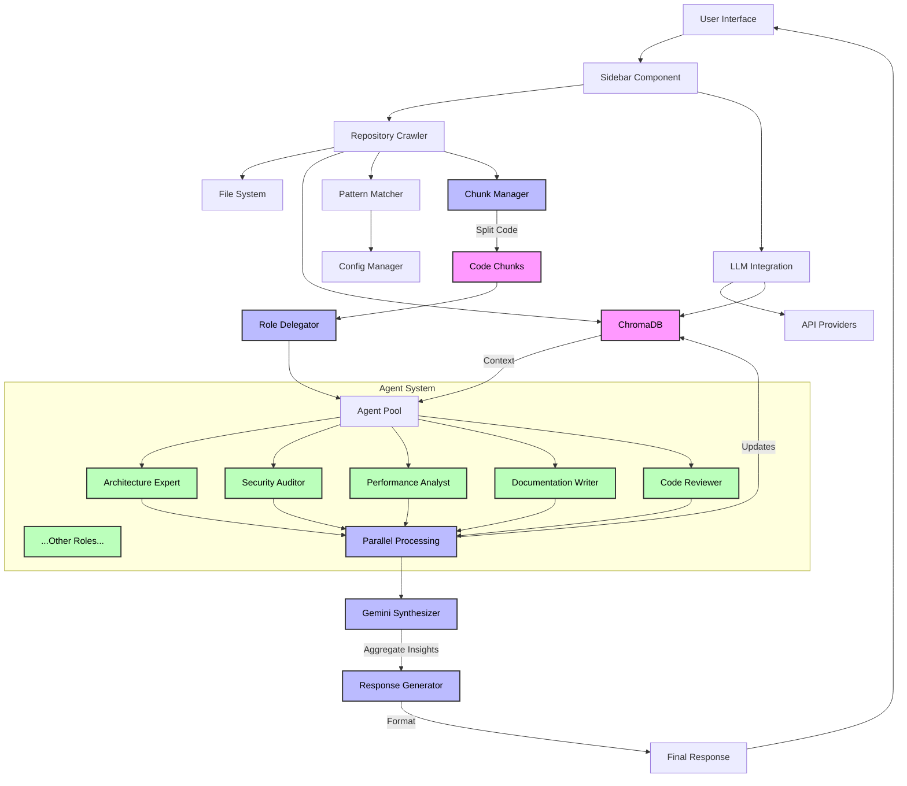

# Repository Crawler 🔍

> ⚠️ **IMPORTANT: Work in Progress** ⚠️
> 
> This project is under active development and is **NOT** production-ready. Use at your own discretion.
> Features may be incomplete, unstable, or change without notice. This entire app was created with AI prompting only, not a single line was written by a human.

## Overview

Repository Crawler is an experimental tool that combines multi-agent LLM analysis with local codebase exploration. It provides a streamlined interface for code analysis, documentation, and understanding through:

- 🌲 Interactive file tree visualization with VS Code-style interface
- 🤖 Multi-agent LLM analysis with specialized roles
- 💾 Persistent memory using ChromaDB
- 📊 Real-time token usage and cost tracking
- 🔄 Parallel agent analysis capabilities
- 🔑 Flexible API key management
- 🎯 Robust ignore pattern system

## Architecture

Our system uses a multi-agent architecture for comprehensive code analysis:



## Features

### Core Functionality
- **File System Analysis**: Efficient traversal and analysis of large codebases
- **Pattern Matching**: Robust ignore pattern system with wildcard support
- **Multi-Agent Analysis**: Up to 25 specialized roles working in parallel
- **Memory System**: Persistent context storage using ChromaDB

### LLM Integration
- **OpenAI**: GPT-4, GPT-3.5
- **Anthropic**: Claude
- **DeepSeek**: Code-specialized models
- **Google**: Gemini 1.5 Pro (Coordinator)

### User Interface
- **Interactive Tree**: VS Code-style file navigation
- **Syntax Highlighting**: Language-aware code display
- **Configuration UI**: Easy pattern and API management
- **Progress Tracking**: Real-time analysis status

## Installation

```bash
# Clone the repository
git clone https://github.com/justinlietz93/Reposi-Parser-Windows-Linux.git
cd Reposi-Parser-Windows-Linux

# Create and activate virtual environment
python -m venv venv
source venv/bin/activate  # On Windows: venv\Scripts\activate

# Install dependencies
pip install -r requirements.txt
```

## Quick Start

1. Start the application:
```bash
streamlit run main.py
```

2. Configure your environment:
   - Add API keys in the LLM Settings tab
   - Set up repository path in File Settings
   - Configure ignore patterns if needed

3. Begin analysis:
   - Select files/directories in the tree view
   - Choose analysis type
   - View results in real-time

## Current Status

### Implemented ✅
- Basic file system traversal
- Multi-provider LLM support
- Interactive file tree
- Configuration persistence
- Robust ignore pattern system
- API key handling
- ChromaDB integration
- Logging system

### In Progress 🔄
- Performance optimizations
- Security enhancements
- Error handling improvements
- Memory management
- Multi-agent coordination
- Pattern matching optimization

### Planned ⏳
- Advanced caching system
- Distributed analysis
- Plugin architecture
- Custom role definitions
- Advanced security features
- Pattern testing framework

## Known Limitations

- Large repositories (>1GB or >10k files) may experience performance issues
- Memory usage can be significant with large codebases
- UI responsiveness varies with repository size
- Pattern matching overhead on deep directory structures

## Contributing

This project is in active development. While contributions are welcome, please note that significant changes may occur.

1. Fork the repository
2. Create your feature branch
3. Submit a pull request

## License

MIT License - See LICENSE file for details

## Disclaimer

⚠️ This software is provided "as is", without warranty of any kind. Use at your own risk. The authors assume no liability for data loss, system damage, or any other issues that may arise from using this software.
