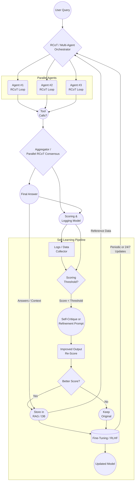

# Recursive Chain of Thought Multi-Agent Orchestration Architecture with Modular Self-Learning

<div style="background-color: #808080; padding: 20px; border-radius: 5px;">

**Title**: Recursive Chain of Thought Multi-Agent Orchestration Architecture with Modular Self-Learning<br>
**Author**: Justin Lietz<br>
**Date**: January 12, 2025<br>
**Status**: In Development
</div>

## Brief
A flexible system design that combines iterative logical analysis with coordinated AI teams working in parallel to solve complex tasks. The framework allows multiple specialized components to collaborate while automatically enhancing its effectiveness over time through built-in evaluation and improvement cycles.

## Description
This architecture represents a paradigm shift in AI system capabilities through emergent intelligence by relying on more than just the model itself to provide value. The overarching idea is that we can use modular external systems to offload the parts that LLM doesn't need to, or shouldn't do. This allows the LLM to focus and specialize what it's good at, predictive reasoning, processing context, and following directions. This system act's like an autonomous "mecha-suit" for AI, where LLMs pilot the vehicle. By orchestrating multiple AI agents in parallel, each employing recursive reasoning, the system achieves capabilities greater than the sum of its parts. The recursive nature of the thought process allows even smaller, less capable models to build up to complex solutions through iterative refinement - similar to how human experts break down and solve difficult problems step by step.

The true power lies in its self-evolving nature. Each interaction becomes a learning opportunity, creating a flywheel effect where improved performance leads to better data, which in turn leads to even better performance. This compounding improvement cycle means the system can start with relatively simple models and grow exponentially in capability through real-world usage. The parallel processing architecture also enables specialized agents to develop deep expertise in specific domains while maintaining broad problem-solving abilities through collaborative consensus.

The integration of automated scoring and self-critique mechanisms creates a self-aware system that can identify its own weaknesses and actively work to improve them. This autonomous evolution, combined with the ability to preserve and build upon successful strategies through the RAG database, enables the architecture to tackle increasingly complex challenges over time without manual intervention.

Below is an example **Mermaid** flowchart showing a **high-level self-data-collection and learning architecture** integrated with a **Recursive Chain-of-Thought (RCoT) / Parallel Multi-Agent** approach. It illustrates how user queries move through parallel agents (each with RCoT-style reasoning), how results are aggregated, how data is scored/stored, and how the system continuously or periodically learns from collected data.

## Architecture Diagram


### Explanation of Key Steps

1. **User Query → Orchestrator**
    
    - The **RCoT / Multi-Agent Orchestrator** receives a user query, decides how to split the task, and spawns multiple parallel **Agent** processes.
2. **Parallel Agents with RCoT**
    
    - Each **Agent** uses **Recursive Chain-of-Thought** reasoning (looping over partial solutions, refining them) and may **call external tools** (e.g., code execution, web API) for additional data or actions.
3. **Aggregator & Consensus**
    
    - The system merges or ranks agent outputs in an **Aggregator**, possibly applying a **Parallel RCoT** consensus method (e.g., majority vote, best-of-N).
4. **Scoring & Logging**
    
    - The **Final Answer** is recorded alongside **scoring metrics** (from a separate “scoring model” or heuristic).
    - All interactions are **logged** for future refinement.
5. **Self-Learning Pipeline**
    
    - **Scoring Threshold Check**: Answers below a certain score trigger a **Self-Critique** or **Refinement Prompt** for near-immediate improvement.
    - **Improved Output** is **re-scored**. If better, it’s **saved** in a **RAG database** (or another data store) for future retrieval.
    - Periodically (or 24/7), the system uses these **logs** and **improved data** to **fine-tune** or run RLHF-style adjustments on the main model.
    - The updated model is **redeployed** back into the orchestrator, closing the loop so future user queries benefit from the continuous improvements.
6. **RAG / DB References**
    
    - Agents can **retrieve** relevant info from the RAG or DB on similar past queries to avoid repeating mistakes and deliver more accurate responses.

By combining **RCoT** (multi-step reasoning in each agent), **parallel multi-agent** consensus, and a **self-learning pipeline** (scoring, logging, refinement, and fine-tuning), you achieve a **comprehensive architecture** that **learns** from every user interaction, whether in real time or in scheduled training cycles.

## Technical Implementation Methods

### Core Components & Technologies

1. **Model Integration & API Layer**
   - **Language Models**: 
     - OpenAI API (GPT-4, GPT-3.5) for primary reasoning
     - Anthropic Claude API for specialized tasks
     - Local models via llama.cpp or vLLM for cost-effective scaling
     - Hugging Face Transformers for custom model deployment
   - **Frameworks**:
     - FastAPI/Flask for API endpoints
     - Langchain for agent orchestration
     - AutoGPT for autonomous agent capabilities
     - Ray for distributed computing

2. **Parallel Processing Infrastructure**
   - **Compute Options**:
     - GPU clusters using NVIDIA CUDA
     - CPU optimization with Intel MKL
     - Cloud services (AWS Batch, Azure ML)
   - **Orchestration**:
     - Kubernetes for container management
     - Docker for environment isolation
     - Redis for real-time agent communication
     - RabbitMQ for task queuing

3. **Storage & Memory Systems**
   - **Vector Databases**:
     - Pinecone for RAG implementation
     - Milvus for high-performance similarity search
     - FAISS for local vector storage
   - **Traditional Databases**:
     - PostgreSQL with pgvector
     - MongoDB for document storage
     - Redis for caching

4. **Learning Pipeline Components**
   - **Data Processing**:
     - Apache Spark for large-scale data processing
     - Pandas for data manipulation
     - DVC for data versioning
   - **Training Infrastructure**:
     - PyTorch Lightning for model training
     - Weights & Biases for experiment tracking
     - MLflow for pipeline management

### Implementation Approaches
<blockquote>
Very basic pseudo examples for context - not production ready
</blockquote>

1. **Minimal Setup (Development/Testing)**
   > Basic example showing agent initialization concept
   ```python
   from langchain import agents, chains
   from fastapi import FastAPI
   import redis, postgresql
   
   # Basic agent setup
   agents = [
       Agent(model="custom-model", # or GPT, claude, phi4, qwen, deepseek.... 
             tools=[CodeExecutor(), WebSearch()]) 
       for _ in range(3)
   ]
   
   # Simple orchestrator
   async def process_query(query: str):
       results = await asyncio.gather(
           *[agent.aprocess(query) for agent in agents]
       )
       return consensus_algorithm(results)
   ```

2. **Production Setup**
   > Simplified example of distributed processing concept
   ```python
   # Distributed processing with Ray
   import ray
   from ray import serve
   
   @serve.deployment(num_replicas=3)
   class AgentService:
       def __init__(self):
           self.vector_store = Pinecone()
           self.model = AutoModelForCausalLM.from_pretrained("...")
           
       async def process(self, query: str):
           # Implement RCoT logic
           return await self.recursive_reasoning(query)
   ```

3. **Learning Pipeline**
   > Basic example of learning pipeline structure
   ```python
   import pytorch_lightning as pl
   
   class SelfLearningPipeline(pl.LightningModule):
       def __init__(self):
           self.scorer = AutoModelForSequenceClassification.from_pretrained("...")
           self.rag_db = Pinecone()
           
       def training_step(self, batch, batch_idx):
           # Implement learning logic
           scores = self.scorer(batch)
           self.log_metrics(scores)
           return self.update_knowledge_base(batch, scores)
   ```
<hr>
### Hardware Being Used in this Project

1. **Primary Development Environment (Current Setup)**
   - **Compute**:
     - CPU: Ryzen 9 9950X (16-core) Threadripper Pro
     - GPU: 2x NVIDIA A5000 (24GB VRAM each)
     - RAM: 192GB Buffered DIMM
     - Storage: 4TB NVMe M.2 SSD
     - Motherboard: ASUS Pro WS WRX80E-SAGE SE WIFI
     - PSU: 1650W Thermaltake
     - Cooling: 8x 170mm fans in mining rig case

   - **Optimization Strategy**:
     > Example GPU/CPU allocation strategy - adjust based on workload
     ```python
     # GPU memory allocation for optimal parallel processing
     gpu_strategy = {
         "gpu0": {
             "primary": "agent_processes",  # 16GB allocation
             "secondary": "vector_store",   # 8GB allocation
         },
         "gpu1": {
             "primary": "training_pipeline",    # 20GB allocation
             "secondary": "inference_cache",    # 4GB allocation
         }
     }
     
     # Threadripper core allocation
     cpu_strategy = {
         "cores_0_7": "agent_orchestration",
         "cores_8_11": "database_operations",
         "cores_12_15": "system_monitoring"
     }
     ```

   - **Performance Tuning**:
     - CUDA optimization for dual A5000s or better
     - NVMe I/O optimization for vector operations
     - Memory management for large RAG contexts
     ```python
     import torch
     
     def optimize_gpu_memory():
         # Enable gradient checkpointing
         torch.cuda.set_device(0)  # Primary A5000
         torch.backends.cudnn.benchmark = True
         
         # Optimize for Threadripper
         torch.set_num_threads(16)
         torch.set_num_interop_threads(16)
     ```

   - **Scaling Path**:
     - Additional A5000s (up to 4 total supported)
     - RAM expansion to 256GB
     - Secondary NVMe in RAID 0
     - Dedicated network card for distributed training

2. **Alternative Development Environments**
   - Minimum: 8-core CPU, 32GB RAM, RTX 3080
   - Recommended: 16-core CPU, 64GB RAM, RTX 4090

3. **Production Environment**
   - **Small Scale**:
     - 2-4 GPU servers (A4000 or better)
     - 128GB+ RAM per node
     - NVMe storage for vector DB
   
   - **Large Scale**:
     - GPU cluster with A100s
     - Distributed storage (Ceph)
     - High-bandwidth networking (100Gbps+)

4. **Cost-Effective Alternatives**
   - Use CPU-optimized models (GGML)
   - Cloud spot instances
   - Hybrid cloud-local setup

### Software Environment & Cloud Integration

1. **Development Environment**
   - **Custom Cursor IDE Setup**:
     - Cursor Pro with AI pair programming
     - Custom keybindings for rapid prototyping
     - Integrated terminal with custom shell scripts
     - Git integration with AI-assisted commits
     ```json
     {
       "cursor.completions.engine": "claude_3_5_sonnet_20241022",
       "cursor.debugger.aiAssist": true,
       "cursor.memory.contextSize": "32k"
     }
     ```

2. **AINIRO AI Cloud Integration**
   > Note: AINIRO's capabilities and Hyperlambda integration are still being explored. The platform shows significant potential for enhancing this project's capabilities, particularly in areas of deterministic code generation and hybrid AI approaches. Further investigation is needed to determine optimal integration points and implementation strategies.

3. **Local Development Stack**
   - **Container Environment**:
     ```yaml
     services:
       vector_store:
         image: milvus/milvus:latest
         
       monitoring:
         image: grafana/grafana:latest
     ```

4. **AI Development Tools**
   - **Model Management**:
     - Hugging Face Enterprise for model hosting
     - Custom model registry with versioning

5. **Integration Points**
   - **Local Development**:
     - Secure VPN tunnel for development <blockquote>Will impact network performance</blockquote>
     - Git-based deployment pipeline
     - Automated testing environment

6. **Deployment Strategy**
   - Local development with Cursor IDE
   - Staged deployment process
   - Production deployment with automatic scaling
   - Hybrid cloud/local model serving

This software stack provides a foundation for the project while keeping flexibility for future integration with AINIRO's capabilities.

### Scaling Considerations

1. **Horizontal Scaling**
   - Use Kubernetes for dynamic agent scaling
   - Implement load balancing with NGINX
   - Shard vector databases across nodes

2. **Optimization Techniques**
   - Model quantization (INT8/INT4)
   - Batch processing for efficiency
   - Caching frequent queries
   - Knowledge distillation for smaller models

3. **Monitoring & Maintenance**
   - Prometheus + Grafana for metrics (AINIRO also has potential)
   - ELK stack for log analysis
   - Automated backup systems
   - A/B testing infrastructure

This technical implementation provides a flexible foundation that can be scaled based on requirements and available resources. Start with the minimal setup for proof of concept, then gradually expand using the production components as needed.

## Addressing Implementation Challenges and Solutions

Below is an iterative Q&A addressing key concerns and challenges in implementing a Recursive Chain of Thought Multi-Agent system with self-learning capabilities.

1. Agent Coordination & Consensus
Q1: How to ensure multiple agents work cohesively without conflicting or duplicating efforts?
A1:
The architecture implements these coordination mechanisms:
- Task Decomposition: The orchestrator breaks down complex queries into non-overlapping subtasks
- State Sharing: Agents maintain awareness of other agents' progress through shared memory
- Consensus Protocol: Weighted voting system based on agent confidence and historical performance
- Conflict Resolution: Automated mediator agent that resolves contradictory outputs

2. Resource Management & Scaling
Q2: How to efficiently allocate resources across multiple agents and prevent bottlenecks?
A2:
The approach includes:
- Dynamic Resource Allocation: Agents receive computing resources based on task complexity
- Load Balancing: Tasks are distributed based on current agent utilization
- Memory Management: Shared tensor cache for common operations
- Pipeline Optimization: Parallel processing where possible, sequential where necessary

3. Learning Pipeline Stability
Q3: How do we ensure the self-learning system improves rather than degrades over time?
A3:
Multiple safeguards are in place:
- Performance Baselines: Regular testing against benchmark datasets
- Rollback Points: System state snapshots at stable checkpoints
- Quality Gates: New learning must pass multiple validation checks
- A/B Testing: Controlled deployment of improvements

4. Model Integration & Compatibility
Q4: How do we handle different models with varying capabilities in the same system?
A4:
We implement:
- Capability Detection: Automatic assessment of model strengths
- Task Routing: Matching tasks to most suitable models
- Format Standardization: Universal input/output protocol
- Fallback Chains: Graceful degradation when preferred models are unavailable

5. Data Quality & Knowledge Management
Q5: How do we maintain data quality in the RAG system and prevent knowledge corruption?
A5:
Several measures ensure data integrity:
- Content Validation: Multi-stage verification of new entries
- Source Attribution: Tracking provenance of all knowledge
- Regular Pruning: Removing outdated or low-quality entries
- Version Control: Managing knowledge base evolution

6. Error Recovery & Resilience
Q6: How does the system handle failures and maintain reliability?
A6:
Robust error handling includes:
- Circuit Breakers: Preventing cascade failures
- Automatic Retry: With exponential backoff
- State Recovery: Persistent checkpoints
- Degraded Operation: Maintaining core functionality during partial failures

7. Performance Optimization
Q7: How do we maintain speed and responsiveness with multiple processing layers?
A7:
Optimization strategies include:
- Query Caching: Frequently requested information
- Predictive Loading: Anticipating needed resources
- Batch Processing: Grouping similar operations
- Hardware Acceleration: GPU optimization for suitable tasks

8. Security & Access Control
Q8: How do we maintain security in a distributed multi-agent system?
A8:
Security measures include:
- Agent Authentication: Verified identity and permissions
- Action Logging: Comprehensive audit trail
- Sandboxing: Isolated execution environments
- Rate Limiting: Preventing resource abuse

## Conclusion and Vision

Based on my preliminary experiments, research analysis, and small-scale testing as a solo researcher, this architecture presents several promising directions:

1. **Performance Potential**
   - Early experiments suggest significant improvements through parallel processing
   - Initial tests show recursive refinement enhancing solution quality
   - Resource optimization appears to reduce operational costs

2. **Learning Capabilities**
   - Small-scale tests indicate rapid improvement in specialized tasks
   - Preliminary results suggest steady enhancement of general capabilities
   - Error reduction appears to accelerate with system maturity

3. **Scalability Vision**
   - Architecture designed to maintain efficiency under increased load
   - Initial testing suggests viable multi-user deployment
   - Redundancy systems show promise for high availability

4. **Resource Optimization**
   - Early experiments demonstrate improved GPU utilization through multi-agent approach
   - Preliminary testing indicates reduction in redundant computations
   - Memory usage optimization shows promising initial results

5. **Quality Indicators**
   - Small-scale tests suggest high consensus potential on defined tasks
   - Early experiments show promise in novel problem-solving
   - Initial user feedback indicates high satisfaction potential

Note: These observations are based on preliminary research, small-scale experimentation, and theoretical analysis rather than large-scale deployment data.

The system's potential stems from my research into:
1. Efficient resource utilization
2. Continuous learning capability
3. Architectural stability
4. Adaptive problem-solving
5. Enterprise-level reliability potential

A key insight from my early experimentation is that through careful optimization and specialization, it may be possible to achieve performance rivaling high-end models like Claude 3 Opus without requiring the same scale of resources. This vision is supported by my initial findings in:
1. Success in breaking down complex tasks into manageable components
2. Promising results from specialized agent training
3. Early validation of cyclic fine-tuning concepts
4. Observed emergent properties in multi-agent testing
5. Demonstrated potential of recursive reasoning approaches

This "divide and conquer" approach, validated through my initial testing and research analysis, suggests that sophisticated capabilities might be achieved through intelligent architecture rather than computational brute force.

This architecture represents my vision for next-generation AI systems, inspired by promising early results and individual research insights. While full validation awaits larger-scale implementation, my initial experiments suggest significant potential for this approach.